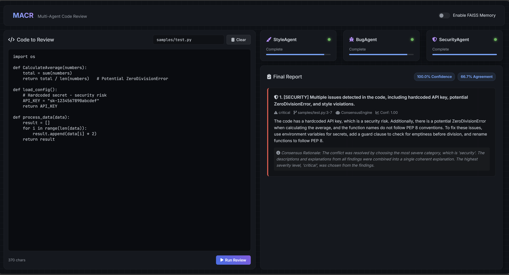

# Multi-Agent Code Review System (MACR)


MACR (Multi-Agent Code Review System) is an autonomous AI-powered code review platform that uses multiple specialized agents to analyze source code. Instead of relying on a single LLM prompt, MACR uses collaborative agents for Style, Bug Detection, and Security analysis, coordinated through an orchestration layer.

The system combines an **Evaluator-Optimizer loop**, **Consensus Engine**, and **FAISS Vector Memory** to produce reliable and context-aware code review reports.

---

## Features

### Multi-Agent Code Analysis
MACR uses specialized agents that independently analyze code:

- **Style Agent** - Detects code quality and style issues
- **Bug Agent** - Identifies correctness problems and potential failures
- **Security Agent** - Finds security vulnerabilities and risky patterns

Agents execute concurrently using a custom asyncio-based orchestrator.

---

### Evaluator-Optimizer Loop

Each agent evaluates and refines its own findings using confidence-based iterations to reduce incorrect suggestions and improve reliability.

---

### Consensus Engine

Multiple agent findings are merged using semantic similarity and severity-based conflict resolution to generate a unified review report.

---

### RAG Memory System

MACR uses:

- FAISS Vector Database
- Sentence Transformer embeddings

to retrieve similar historical reviews and provide additional context during analysis.

---

## Architecture

```
                 Code Input
                     |
                     v
              Coordinator
                     |
     --------------------------------
     |              |               |
     v              v               v
Style Agent     Bug Agent     Security Agent
     |              |               |
     --------------------------------
                     |
                     v
            Consensus Engine
                     |
                     v
             FAISS Memory Store
                     |
                     v
            Markdown Report
```

---

## Demo



## Installation

### Clone Repository

```bash
git clone https://github.com/AdyaSinha1/MACR.git
cd MACR
```

### Create Virtual Environment

```bash
python -m venv venv
```

Activate:

Windows:

```bash
venv\Scripts\activate
```

Linux/Mac:

```bash
source venv/bin/activate
```

### Install Dependencies

```bash
pip install -e .
```

---

## Configuration

Create a `.env` file:

```env
GROQ_API_KEY=your_groq_api_key_here
```

---

## Usage

Run MACR on a Python file:

```bash
python -m src.cli.main samples/test.py
```

The generated review report will be saved as:

```
review_report.md
```

Example output:

```
Initializing memory store...
Starting multi-agent review...
StyleAgent starting analysis
BugAgent starting analysis
SecurityAgent starting analysis
Resolving conflicting findings
Stored review in FAISS memory
Review complete!
```

---

## Web Interface

Start the API server:

```bash
uvicorn src.api.app:app --reload
```

Open:

```
http://127.0.0.1:8000
```

---

## Docker Support (optional)

Build and run using Docker:

```bash
docker-compose build
docker-compose run macr
```

---

## Evaluation

Run evaluation on sample code:

```bash
python scripts/evaluate.py samples/test.py
```

---

## Project Structure

```
MACR
│
├── src
│   ├── agents
│   │   ├── style_agent.py
│   │   ├── bug_agent.py
│   │   └── security_agent.py
│   │
│   ├── orchestrator
│   │   ├── coordinator.py
│   │   └── consensus.py
│   │
│   ├── memory
│   │   ├── embeddings.py
│   │   └── faiss_store.py
│   │
│   ├── core
│   └── reporting
│
├── tests
├── samples
└── README.md
```

---

## Example Review Report

MACR generates a structured Markdown report containing:

- Severity level
- Issue location
- Agent responsible
- Confidence score
- Consensus reasoning

Example:

```
Finding:
Hardcoded API key detected

Severity:
Critical

Agent:
ConsensusEngine

Confidence:
100%
```

---

## Future Improvements

- AST-based chunking for very large files
- Pull Request integration
- Support for multiple programming languages
- Improved historical learning
- Automated code fix suggestions

---

## License

MIT License